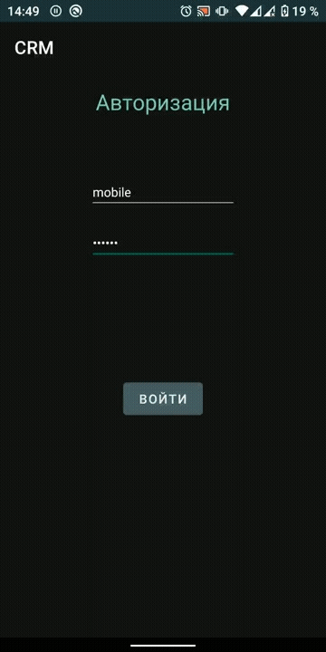
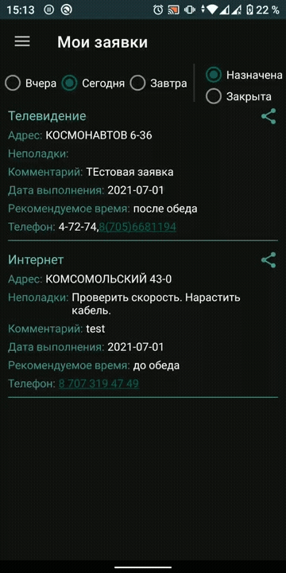

#  Mobile CRM

Мобильный клиент для корпоративной CRM.  
Приложение разработано для повышения удобства использования и  
скорости работы с CRM сотрудниками фирмы (интернет провайдер).
В первую очередь преднозначено для дежурных-мастеров и монтажников.

### Основной функционал:

##### _Меню "Мои заявки"_
* Просмотр списка назначенных (выполненных) на мастера заявок.
* Закрытие заявок с указанием комментариев, сумм и списанием материалов.
* Доступ к карточки клиента:
  * Просмотр информации о клиенте (порт коммутатора, тариф, баланс и т.д)
  * Просмотр истории заявок и комментариев к ним.
  * Возможность диагностики неисправности с телефона:
    * Кабель тест с порта коммутатора. (Показывает на каком метре обрыв.)
    * Link status Up/Down.
    * Speed port 10/100/1000 mbps.
    * Количество ошибок на порту.
* Получение Push уведомлений о новых заявках

 | 

##### __Меню "Клиенты"__
* Просмотр абонентской базы сортированной по мкр/ул/дом/подъезд/кв.
* Фильтр по услугам Интернет / ТВ / Домофон.
* Возможность просмотра карточки абонента и использования доступных
инструментов для диагностики.


##### _Меню "Фото узла"_
* Возможность сделать фото из приложения.
* Выбор дома фото узла которого было сделано для привязки в базе.
* Отправка фото на сервер


***

### Техническая информация
* Приложение написано на Kotlin с использованием патерна MVVM.
* Клиент-серверное, работает с собственным api на Python.
* Основной стек используемых технологий:
  * [ViewModel](https://developer.android.com/topic/libraries/architecture/viewmodel)
  * [LiveData](https://developer.android.com/topic/libraries/architecture/livedata)
  * [ViewBinding](https://developer.android.com/topic/libraries/view-binding)
  * [JetPack Navigation](https://developer.android.com/guide/navigation/navigation-getting-started)
  * [Kotlin Coroutines](https://developer.android.com/kotlin/coroutines)
  * [Retrofit 2](https://square.github.io/retrofit/)
  * [Firebase](https://firebase.google.com), Push [FCM](https://firebase.google.com/docs/cloud-messaging)
  * [JetPack Compose](https://developer.android.com/jetpack/compose)

***

### Структура проекта
```
project
|   readme.md
|   build.gradle  # gradle уровня модуля.
|
└───app
    |   build.gradle  # gradle уровня приложения.
    |
    └─── ../android/bignerdranch/mobilecrm
        |
        └─── model 
        |   |
        |   └─── modelsDB  # Модели сущностей БД СРМ.
        |   |
        |   └─── networkModel  # Модели данных различных сетевых запросов.
        |   |
        |   └─── otherModel  # Прочие сущности.
        |   |
        |   └─── viewModels  # ViewModel используемые фрагментами.
        |
        └─── network  # Retrofit
        |   └─── NetworkApiService  # Api всех сетевых запросов.
        |   └─── NetworkModule  # Содержит 2 модуля(один с Interceptor'ом) Retrofit.
        |
        └─── service # Может кастомизировать Push уведомления. Не используется. Все по default.
        |
        └─── ui
        |   └─── activity  # Single activity
        |   └─── composeFun  # Содержит пере используемые Compose функции отображения интерфейса.
        |   └─── fragments 
        |   |   └─── admin # В разработке
        |   |   └─── auth  # Фрагмент авторизации
        |   |   └─── clients  # Содержит Compose фрагменты связанные с отображением карточки клиента и тд.
        |   |   └─── photo  # Фрагменты поиска адреса узла и процесса фото с его отправкой на сервер.
        |   |   └─── task  # Фрагменты с отображением списка заявок, закрытия,списания матеряла и тд.
        |   |
        |   └─── theme  # Темы для composable функций.
        |
        └─── utilits  # Вспомогательные функции, константы, библиотеки.
```
***
Примечания:
* JetPack Compose используется в экспериментальных целях, что бы познакомится с технологией.
* Проект не соберется без оригинального google-services.json
* Скачать [apk](crm ver 0.3.9.apk)
